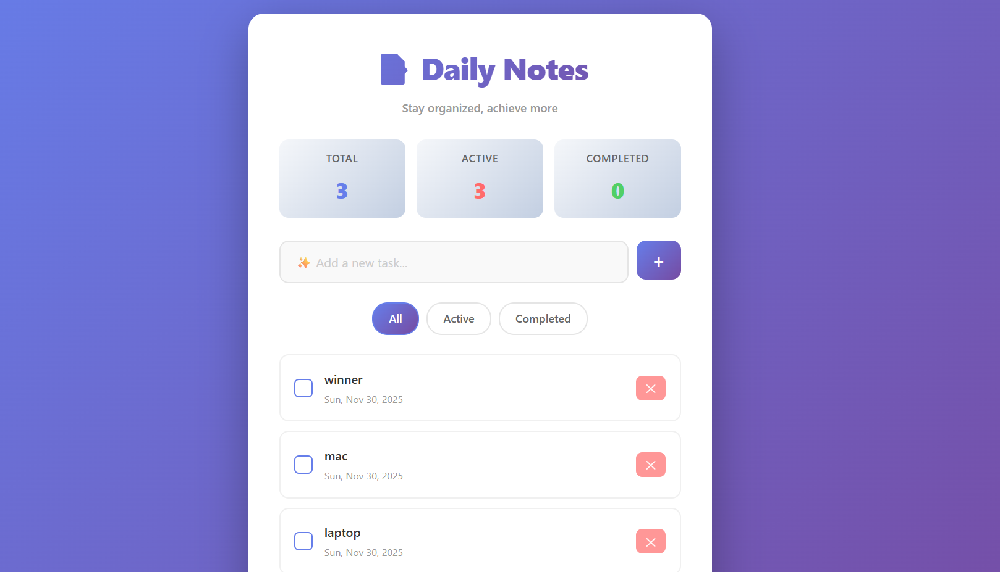

# 📝 Daily Notes

A beautiful, modern task manager app built with React, TypeScript, and Vite. Stay organized and achieve more with Daily Notes!

## ✨ Features

- ✅ **Add Tasks** - Create new tasks with a single click or press Enter
- 📅 **Auto-dated Tasks** - Tasks are automatically timestamped
- ✔️ **Mark Complete** - Check off completed tasks with smooth animations
- 🗑️ **Delete Tasks** - Remove tasks instantly
- 🔍 **Filter Tasks** - View All, Active, or Completed tasks
- 📊 **Live Stats** - Real-time tracking of total, active, and completed tasks
- 🎨 **Beautiful UI** - Modern gradient design with smooth animations
- 📱 **Responsive Design** - Works perfectly on desktop, tablet, and mobile

## 🖼️ Preview



## 🚀 Getting Started

### Prerequisites
- Node.js 16+ 
- npm or yarn

### Installation

```bash
# Clone the repository
git clone https://github.com/EpsitaMalla/daily-notes.git
cd daily-notes

# Install dependencies
npm install

# Start development server
npm run dev
```

The app will open at `http://localhost:5174/`

### Build for Production

```bash
npm run build
```

Output will be in the `dist/` folder.

## 🛠️ Tech Stack

- **React 19** - UI framework
- **TypeScript** - Type safety
- **Vite** - Build tool & dev server
- **CSS3** - Custom styling with gradients and animations

## 📦 Project Structure

```
src/
├── App.tsx       - Main app component with task logic
├── App.css       - Beautiful app styles
├── main.tsx      - Entry point
├── index.css     - Global styles
└── assets/       - Images and SVGs
```

## 💡 How to Use

1. **Add a Task** - Type in the input field and press Enter or click the + button
2. **Complete a Task** - Click the checkbox to mark as complete
3. **Delete a Task** - Click the ✕ button to remove
4. **Filter Tasks** - Use the filter buttons to view different task categories

## 📝 License

MIT - Feel free to use this project!
